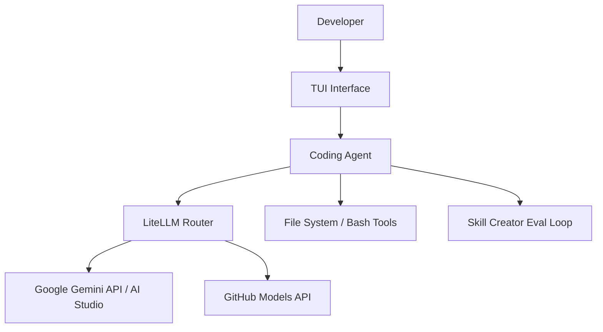

# Gemmex
> **"Terminal-based Autonomous Coding Agent powered by Free Multi-LLM Rotation"**

Gemmex는 터미널(TUI) 환경에서 작동하는 자율 코딩 에이전트입니다. Claude Code와 GPT Codex의 강력한 워크플로우를 레퍼런스 삼아 개발되었으며, 사용자가 유료 정기 구독을 하지 않고도 완전 무료로 강력한 AI 엔지니어를 거느릴 수 있는 도구를 지향합니다.

본 프로젝트는 상업적 이용 목적이 전혀 없으며, 월 22달러 상당의 유료 결제 플랜과 비교했을 때 약 80% 이상의 실전 성능을 구현하여 누구나 부담 없이 쓸 수 있는 실사용 중심의 로컬 가상환경 코딩 어시스턴트를 제공하는 것을 목표로 합니다.

---

## 주요 특징 (Key Features)

* **Autonomous Agentic Loop:** 생각(Thought) → 행동(Action) → 관찰(Observation) 패턴으로 복잡한 코딩 과업을 스스로 해결합니다.
* **Intelligent Model Rotation:** Google AI Studio(Gemini / Gemma 4) API 키를 지능적으로 로테이션하여 무료 티어의 호출 제한(Rate Limit)을 우회하고 24/7 중단 없는 개발 환경을 지원합니다.
* **Skill-Creator Workflow:** 단순히 코드를 일회성으로 짜는 것을 넘어, 개발한 코드를 스스로 평가(Eval)하고 런타임 에러를 감지하여 개선하는 반복적인 최적화 루프를 통해 바이브 코딩(Vibe Coding)을 극대화합니다.
* **Safety First (Human-in-the-loop):** 파일 수정, 쓰기, 셸 명령어 실행 등 파괴적인 작업은 사용자의 명시적인 승인 없이는 작동하지 않으며 위험 명령어를 필터링합니다.
* **Ultra-Fast TUI:** Rich 및 Textual 라이브러리를 활용하여 터미널 환경에서도 직관적이고 아름다운 대시보드와 멀티라인 프롬프트 입력창을 제공합니다.

---

## 아키텍처 (Architecture)

프로젝트 목표 (Goals)
터미널에서 즉시 실행되는 강력하고 가벼운 TUI 코딩 에이전트 제공.

Google AI Studio API 키 멀티 로테이션 및 속도 제한 감지를 통한 가용성 극대화.

Claude Code(Sonnet 4.6), GPT Codex(GPT 5.3) 벤치마크 대비 80% 이상의 기능적 등가성(Parity) 달성.

유료 구독 스트레스 없는 개발자 친화적 오프라인/로컬 퍼스트 환경 구축.

---

현재 지원 기능 (Current Features)
파일 시스템 및 Git 도구 (File & Git Tools)
read_file, write_file, edit_file: 파일 읽기/쓰기 및 안전한 백업 기반 수정

list_dir, find_files, search_in_files: 프로젝트 디렉토리 탐색 및 키워드 검색

git_status, git_diff: 형상 관리 상태 추적 및 변경점 파악

샌드박스 및 실행 도구 (Execution & Sandbox)
/tmp/gemma_sandbox 내에서 안전하게 생성된 코드 실행

런타임 에러 자동 탐색 및 패키지 누락 시 설치 확인 자동화

실패한 코드 블록에 대한 자동 복구/재시도 루프(Auto-retry loop) 지원

엔지니어링 패널 (System Operations)
다중 Google AI Studio API 키 자동 로테이션 및 일시적 블로킹 관리

도구 실행 로그 세부 패널(Tool Log Panel) 스위칭 제공

세션 저장 및 불러오기(Session Save/Load) 지원

---

설치 방법 (Installation)

cd /home/wego/coder_ws
python3 -m pip install textual rich google-genai

---

API 키 설정 (API Key Setup)
Gemmex를 구동하려면 하나 이상의 Google AI Studio API 키가 필요합니다. 환경 변수 또는 설정 파일을 통해 등록할 수 있습니다.

단일 키 등록:
export GEMMA_API_KEY="your-api-key"

다중 키 로테이션 등록 (쉼표로 구분):
export GEMMA_API_KEYS="key-1,key-2,key-3"
프로젝트 내부 config/key_loader.py를 통해 config/settings.env 혹은 config/api_keys/gemma_api_keys.txt 파일 형태로도 관리할 수 있습니다.

---

사용 방법 (Usage)
터미널에서 에이전트를 실행합니다:
cd /home/wego/coder_ws
python3 Gemmex.py

프롬프트 예시
main.py 파일을 읽고 버그를 찾아줘

/home/wego/project/app.py를 읽고 리팩토링 계획을 세워줘

테스트가 실패하는 원인을 찾고 수정해줘

---

내장 명령어 (Built-in Commands)
TUI 내부 콘솔에서 다음 명령어를 조합해 에이전트를 제어할 수 있습니다:
명령어,기능 설명
/help,지원하는 전체 명령어 리스트 출력
/new,새로운 대화 세션 시작
/save / /load <file>,현재 세션 저장 및 이전 세션 불러오기
/model next,로테이션 파이프라인의 다음 모델로 수동 스위칭
/tooldetail,상세 도구 실행 로그 패널 토글
/auto / /noauto,AI가 생성한 코드 블록의 자동 실행 활성화/비활성화
!<command>,에이전트 환경에서 직접 셸(Shell) 명령어 실행
/quit,에이전트 종료

---

안전 제어 모델 (Safety Model)
모든 쓰기/수정/실행 작업은 인간의 검토(Human-in-the-loop) 및 확인을 거칩니다.

파괴적인 셸 명령어(예: rm -rf 계열 변종)는 사전에 차단됩니다.

기존 소스코드는 수정 전 자동으로 백업 디렉토리에 보관됩니다.

---

현재 프로젝트 상태 및 벤치마크 (Project Status)
Gemmex는 현재 MVP(최소 기능 제품) 단계에서 활발히 고도화 중입니다.

최근 로컬 환경에서 수행한 알고리즘 테스트 세트 검증 결과는 다음과 같습니다:

내부 컴포넌트 성능 테스트: 통과 (대부분의 작업이 FAST/OK 영역 내에서 안정적 구동)

자체 코딩 벤치마크: 9개 중 8개 성공 (정확도 89% 달성)

참고: 위 결과는 로컬 리그 테스트 결과이며, 향후 Claude Code 및 GPT Codex와의 공정한 성능 대조를 위해 표준화된 3자 통합 벤치마크 하네스(Harness)를 구축할 예정입니다.

향후 측정 예정인 벤치마크 차원
알고리즘 성능 코딩 테스트

다중 파일 단위 리포지토리 리팩토링 능력

복합 버그 디버깅 및 테스트 코드 복구 태스크

장기 실행(Long-running) 시 에이전트의 안정성 및 비용 대비 효율

---

향후 로드맵 (Roadmap)
[ ] Gemmex.py 내에 스킬(Skill) 로딩 및 자동 트리거 기능 완전히 통합

[ ] Claude Code / GPT Codex 직접 비교용 자동화 벤치마크 하네스 추가

[ ] 500 에러 / 타임아웃 등 네트워크 실패에 대한 복크 핸들링 강화

[ ] 실시간 API 키 헬스 트래킹(정상 작동 여부) 고도화

[ ] 터미널 응답성 및 도구 호출 후 최종 답변 텍스트 안정성 향상

[ ] 간편한 설치를 위한 프로젝트 패키징 작업

---

라이선스 (License)
라이선스 정보는 현재 확정되지 않았습니다. (상업적 활용 목적 없음)

